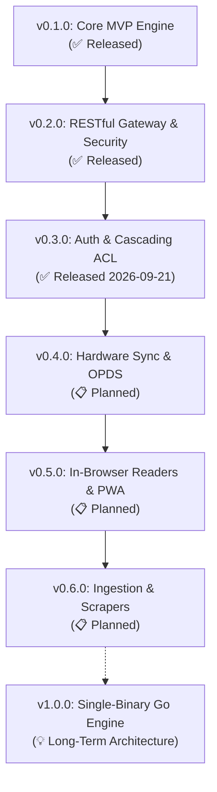

# 🗺️ Skalybr Project Roadmap

This document outlines the phased development roadmap for **Skalybr**, tracking completed milestones, active work in progress, and planned future capabilities. Inspired by gold-standard self-hosted media projects like **Jellyfin**, **Navidrome**, and **Immich**, Skalybr is built in iterative, production-tested releases.

---

## 🧭 Milestone Overview

---

## ✅ Released Milestones

### 🚀 v0.1.0 — Core MVP & High-Performance Engine *(Released)*
- [x] **Flattened Database Read Model (`v_books_flattened`)**: Consolidated SQLite view indexing Books, Authors, Series, Tags, Formats, and Custom `#collection`.
- [x] **`better-sqlite3` Repository Layer**: WAL mode, zero locking overhead, sub-millisecond queries across Calibre libraries.
- [x] **Multi-Library Discovery**: Auto-detection of Calibre libraries in the filesystem.
- [x] **Cover Streaming**: High-throughput on-the-fly WebP thumbnail resizing via `sharp` (libvips).
- [x] **Contract-First OpenAPI 3.1**: Full API specification and interactive Scalar documentation at `/api/reference`.
- [x] **Responsive Web App**: Initial book card grid, debounced search, facet filtering, and book detail dialog.

### 🌐 v0.2.0 — RESTful Architecture, Netflix Gateway & Security *(Released)*
- [x] **Fully RESTful Path Scoping**: Refactored API routes from query parameters (`?library=X`) to scoped paths (`/api/v1/libraries/[library]/books/...`).
- [x] **Netflix-Style Library Gateway**: Root `/` redirector, interactive library switcher cards, and zero-library onboarding state.
- [x] **Security Hardening**:
  - Path confinement and directory traversal guards on book downloads and cover streaming.
  - Zip-slip collision protection and safe upload size limits.
  - Safe error masking preventing internal stack trace leakage.
- [x] **Calibre-Web Migration Tool**: One-click import tool (`/api/v1/migration/calibre-web`) migrating existing user reading progress, custom shelves, and book links.
- [x] **Remote Cloud Library Downloader**: Dropbox and Google Drive URL inspection and streaming importer.

### 🔐 v0.3.0 — Authentication, Multi-Tenancy & Cascading ACL *(Released 2026-09-21)*

Comprehensive multi-user support with Google Drive-style inherited permissions (`Global` $\rightarrow$ `Library` $\rightarrow$ `Shelf`).

- [x] **Phase 1: SQLite Migration Framework** (`commit 95cde75`):
  - Robust migration runner (`lib/db/migrate.ts`) discovering files under `./data/migrations/`.
  - Atomic transactions, concurrency guards, and baseline schema `0001_initial_schema.sql`.
  - Automated CI migration test suite (`testing/unit/migrations.test.ts`).
- [x] **Phase 2: Database Schema & DAOs** (`commit f922c66`):
  - Added `0002_add_is_public_to_libraries.sql`, `0003_create_users.sql`, `0004_create_cascading_acl.sql`.
  - Atomic user CRUD, session epoch increments, and cascading access grant DAOs.
- [x] **Phase 3: Authentication Engine & Session Management** (`commit 4365148`):
  - `bcryptjs` password hashing with constant-time verification.
  - Encrypted HTTP-only cookie sessions via `iron-session` (`lib/auth/session.ts`).
  - First-user bootstrap promotion to active `Admin`; subsequent signups queued as `Pending`.
  - Endpoints: `POST /api/v1/auth/register`, `POST /api/v1/auth/login`, `POST /api/v1/auth/logout`, `GET /api/v1/auth/me`.
- [x] **Phase 4: Cascading ACL Resolution & API Route Guards** (`commit 047fa59`):
  - Ripple-down permission engine (`lib/auth/acl.ts`): Admin bypass $\rightarrow$ Shelf grant $\rightarrow$ Library grant $\rightarrow$ Global grant $\rightarrow$ Public fallback.
  - Route guard helpers (`requireLibraryAccess`, `requireAdmin`, `requireAuth`).
  - Protected API endpoints (`libraries`, `books`, `facets`, `download`, `cover`, `progress`).
  - Admin management APIs: `/api/v1/admin/users` and `/api/v1/admin/users/[id]/grants`.
- [x] **Phase 5: Frontend UI & Admin Panel** (`commit a6e1466`):
  - User profile dropdown in header displaying active persona, library switcher, and auth buttons.
  - Clean Sign In and Register modal with pending approval alert.
  - Admin User & ACL Management modal (Pending approvals + Google Drive-style permission drawer).
  - Dev `QuickSwitch` persona bar (`Guest` $\leftrightarrow$ `Reader` $\leftrightarrow$ `Curator` $\leftrightarrow$ `Admin`).
- [x] **Phase 6: E2E Verification & Release Tagging**:
  - Playwright E2E test suite (`testing/e2e/`) covering auth, library access, admin panel, and QuickSwitch.
  - CI workflow E2E job with Chromium, build, and artifact upload on failure.
  - `v0.3.0` and `v0.3.1` (patch release: version manifest sync & E2E stability).

---

## 📋 Planned Capabilities

### 📡 v0.4.0 — Hardware E-Reader Sync & Open Protocols
Connecting Skalybr directly to hardware e-readers and mobile reading apps without cables:
- [ ] **OPDS 1.2 Catalog Engine (`/opds`)**:
  - Atom+XML catalog feeds for Moon+ Reader, FBReader, Thorium, and KyBook.
  - Hierarchical browsing: by Author, Series, Tags, Custom Shelves, and Recent.
  - OpenSearch XML template for remote in-app catalog search.
- [ ] **Kobo Wireless Sync (`/api/v1/kobo/...`)**:
  - Native Kobo Store sync protocol emulation (`v1/initialization`, `v1/library/sync`, `v1/books/{id}/reading_state`).
  - Bidirectional sync of reading progress, bookmarks, and read status.
  - Per-user device pairing and token authentication.
- [ ] **On-The-Fly KePub Transformation**:
  - Transparent KePub conversion for page-count precision and rapid flipping on Kobo hardware.

### 📖 v0.5.0 — In-Browser E-Readers & Offline PWA
Reading directly in modern browsers without installing third-party apps:
- [ ] **Embedded EPUB Reader**: Fullscreen, responsive EpubJS reader with dark/sepia/light themes, font scaling, TOC navigation, and bookmark sync.
- [ ] **PDF Reader**: High-performance PDF.js viewer with zoom, continuous scrolling, and text selection.
- [ ] **Comic & Manga Reader**: Canvas-based CBZ/CBR image extractor and double-page manga/comic viewer.
- [ ] **Audiobook Streaming**: HTML5 audio player with track position memory for M4B/MP3 audiobooks.
- [ ] **Installable PWA & Offline Storage**: Progressive Web App service worker caching books for offline reading on trains and flights.

### 📥 v0.6.0 — Book Ingestion & Metadata Scrapers
Importing new books, automating metadata tagging, and remote device delivery:
- [ ] **Book File Ingestion & Drag-and-Drop Uploader**: Multi-file upload for EPUB, MOBI, PDF, CBZ, and CBR with automatic cover and metadata extraction.
- [ ] **Online Metadata Scraping Engine**: Multi-provider search against **Google Books**, **Goodreads**, **OpenLibrary**, and **ComicVine** for one-click metadata enhancement.
- [ ] **Send-to-Kindle Delivery**: SMTP emailer delivering books directly to `@kindle.com` addresses.
- [ ] **Safe Directory File Management**: Deterministic renaming of Calibre folders when book titles or authors change.

---

## ⚡ Long-Term Architecture: Optional Go Backend Drop-in

For ultra-low-memory environments (< 30MB RAM) and single static binary distribution:
- [ ] **Go HTTP Engine**: Re-implement the OpenAPI 3.1 contract in Go (`Chi` / `Echo` + `modernc.org/sqlite`).
- [ ] **Embedded Static Frontend**: Embed the compiled Next.js static export directly into the Go binary with `//go:embed`.
- [ ] **Cross-Platform Single Binary**: Ship standalone executables (`./skalybr`) for Linux, macOS, Windows, and Raspberry Pi ARM64 with zero runtime dependencies.

---

## 💡 Feedback & Feature Requests
Have an idea or priority preference? Open an issue or start a discussion on the [GitHub repository](https://github.com/demeesterroeland/skalybr).
