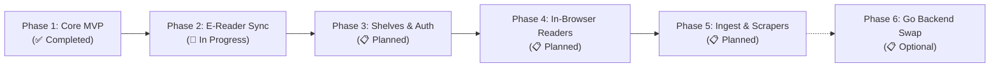

# 🗺️ Skalybr Project Roadmap

This document outlines the phased development roadmap for **Skalybr**, tracking completed milestones, active work in progress, and planned future capabilities.

---

## 🧭 Milestone Overview

---

## ✅ Phase 1: Core MVP & Catalog Engine *(Completed)*

The foundation of Skalybr focuses on rock-solid, sub-millisecond SQLite queries, high-performance image processing, multi-library discovery, and clean OpenAPI 3.1 contracts.

- [x] **Flattened Database View (`v_books_flattened`)**:
  - Auto-generated SQLite view consolidating Books, Authors, Series, Tags, Publisher, Language, Rating, Formats, and Custom `#collection`.
- [x] **`better-sqlite3` Repository Layer**:
  - Connection pooling with SQLite WAL (Write-Ahead Logging) mode and zero locking overhead.
  - Sub-millisecond prepared SQL queries across 491+ books.
- [x] **Multi-Library Discovery & Switching**:
  - Automatic detection and switching across all Calibre libraries in the configured base directory.
- [x] **High-Performance Cover Streaming**:
  - On-the-fly WebP thumbnail generation and streaming powered by `sharp` with HTTP cache headers.
- [x] **Modern React 19 / Tailwind CSS v4 UI**:
  - Responsive book card grid with covers, format badges, and rating stars.
  - Instant debounced search and faceted filtering (by Author, Series, Tag, and Custom Collections).
  - Book detail modal with synopsis and direct format downloads.
- [x] **Book Metadata CRUD**:
  - Full support for updating Title, Rating, and Synopsis in Calibre's native database.
- [x] **OpenAPI 3.1 & Interactive Docs**:
  - Fully typed REST routes with live Scalar documentation at `/api/reference`.
- [x] **Automated Test Suite**:
  - Vitest unit tests verifying repository queries and cover streaming against real Calibre libraries.

---

## 🔄 Phase 2: E-Reader Protocols & Wireless Sync *(In Progress)*

Connecting Skalybr directly to hardware e-readers and mobile reading apps without needing cables.

- [ ] **OPDS 1.2 Catalog Engine (`/opds`)**:
  - Atom+XML catalog feeds for third-party e-reader apps (Moon+ Reader, FBReader, Thorium, KyBook).
  - Hierarchical navigation: By Author, Series, Tags, Collections, and Recent.
  - OpenSearch XML template for remote in-app search.
- [ ] **Kobo Wireless Hardware Sync API (`/api/v1/kobo/...`)**:
  - Emulation of Kobo Store sync protocol (`v1/initialization`, `v1/library/sync`, `v1/books/{id}/reading_state`).
  - Reading progress, bookmarks, and time spent synchronization.
  - Device token authentication and pairing.
- [ ] **On-The-Fly KePub Transformation**:
  - Transparent KePub conversion for enhanced Kobo reading features (page number calculation, fast flipping).

---

## 📋 Phase 3: Shelves, Reading Status & User Authentication *(Planned)*

User profiles, multi-tenancy, and customized bookshelf organization.

- [ ] **Application Database Schema (`app.db`)**:
  - Standard SQL migrations for user accounts, read status, bookmarks, and custom shelves.
- [ ] **Authentication & Security**:
  - Stateless encrypted session cookies (`iron-session`).
  - Reverse-proxy header authentication (`Remote-User`) for Authelia / Authentik setups.
  - Granular RBAC permissions (Admin, Download, Upload, Edit, Viewer).
- [ ] **Reading Progress Tracking**:
  - Read / Unread / In-Progress status toggles with reading history timestamps.
- [ ] **Custom Shelves & Collections**:
  - User-defined public and private shelves.
  - Drag-and-drop book reordering powered by `@dnd-kit`.

---

## 📋 Phase 4: In-Browser E-Readers & PWA Offline Support *(Planned)*

Read books directly inside any web browser on desktop, tablet, or phone without installing external apps.

- [ ] **Embedded EPUB Reader**:
  - Fullscreen, responsive EpubJS reader with dark/sepia/light themes, font scaling, and TOC navigation.
  - Server-side bookmark synchronization.
- [ ] **PDF Viewer**:
  - High-performance PDF.js viewer with zoom, continuous scrolling, and text selection.
- [ ] **Comic & Manga Reader**:
  - Canvas-based CBZ/CBR image extractor and double-page manga/comic viewer.
- [ ] **Audiobook Streaming**:
  - HTML5 audio streaming player with track position remembering for M4B/MP3 audiobooks.
- [ ] **Installable PWA & Offline Cache**:
  - Progressive Web App service worker (`@ducanh2912/next-pwa`) allowing users to install Skalybr as a mobile app and cache current books for airplane/train reading.

---

## 📋 Phase 5: Ingestion, Metadata Scrapers & Emailer *(Planned)*

Importing new books, automating metadata tagging, and remote device delivery.

- [ ] **Book File Ingestion & Uploader**:
  - Multi-file drag-and-drop uploader for EPUB, MOBI, PDF, CBZ, and CBR.
  - Metadata and cover image auto-extraction upon upload.
- [ ] **Online Metadata Scraping Engine**:
  - Multi-provider search against **Google Books**, **Goodreads**, **Amazon**, and **ComicVine**.
  - One-click cover art and synopsis enhancement.
- [ ] **Send-to-Kindle Mailer**:
  - SMTP with TLS/SSL and Gmail OAuth delivery to `@kindle.com` e-reader addresses.
- [ ] **Calibre Directory File Management**:
  - Safe folder renaming (`Author/Title (id)/Title - Author.ext`) when book metadata is edited.

---

## ⚡ Phase 6: Optional Go Backend Drop-in *(Future Architectural Evolution)*

For ultra-low-memory environments (< 30MB RAM) and single static binary distribution.

- [ ] **Go HTTP Server (Chi / Echo)**:
  - Implement the exact OpenAPI 3.1 contract in Go using `oapi-codegen` and `modernc.org/sqlite`.
- [ ] **Embedded React Static Build**:
  - Embed the compiled Next.js static export directly into the Go binary using `//go:embed`.
- [ ] **Single Binary Packaging**:
  - Ship cross-platform standalone executables (`./skalybr`) for Linux, macOS, Windows, and Raspberry Pi ARM64.

---

## 💡 Submitting Feature Requests
Have an idea or priority preference? Open an issue or discussion on the [GitHub repository](https://github.com/demeesterroeland/skalybr).
